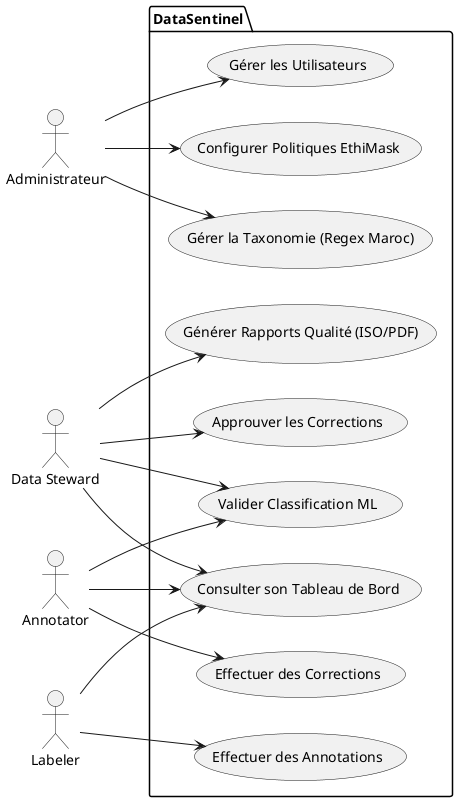
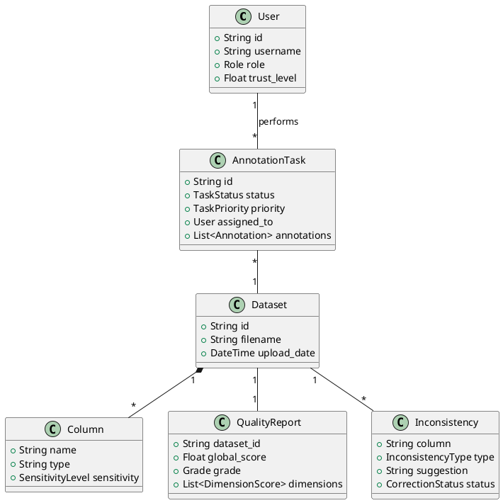
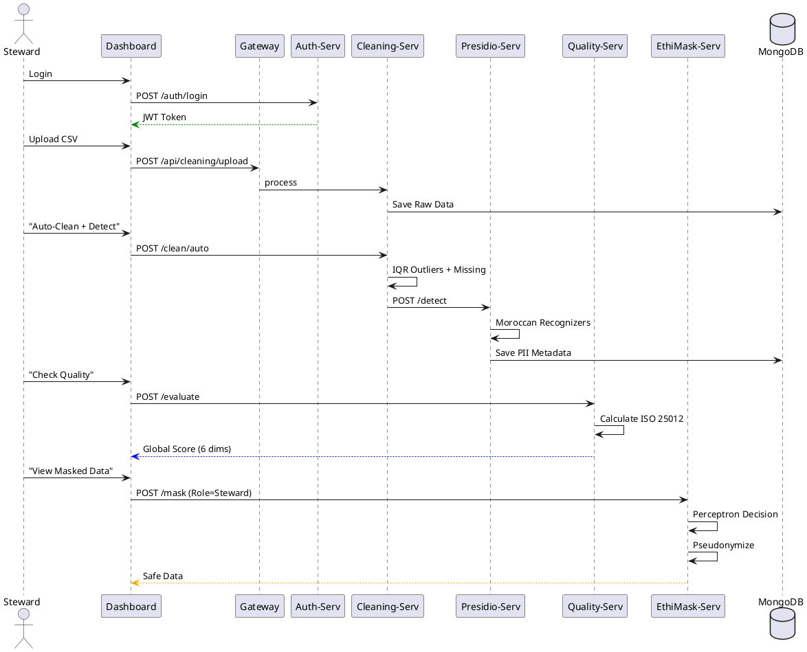
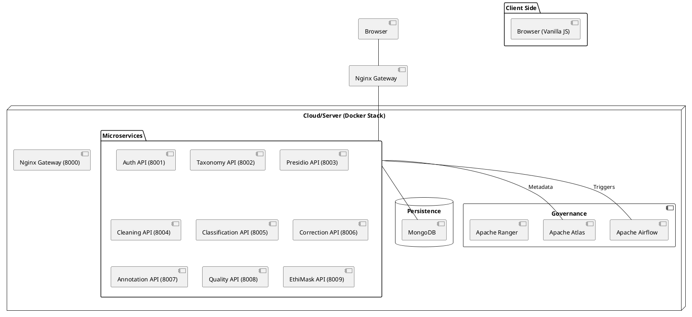

# 📐 Diagrammes UML - DataSentinel (v2.0)

## 1. Diagramme de Cas d'Utilisation

```plantuml
@startuml
left to right direction
actor "Administrateur" as Admin
actor "Data Steward" as Steward
actor "Annotator" as Annotator
actor "Labeler" as Labeler

package DataSentinel {
  usecase "Gérer les Utilisateurs" as UC1
  usecase "Configurer Politiques EthiMask" as UC2
  usecase "Gérer la Taxonomie (Regex Maroc)" as UC3
  usecase "Approuver les Corrections" as UC4
  usecase "Générer Rapports Qualité (ISO/PDF)" as UC5
  usecase "Valider Classification ML" as UC6
  usecase "Effectuer des Corrections" as UC7
  usecase "Effectuer des Annotations" as UC8
  usecase "Consulter son Tableau de Bord" as UC9
}

Admin --> UC1
Admin --> UC2
Admin --> UC3

Steward --> UC4
Steward --> UC5
Steward --> UC6
Steward --> UC9

Annotator --> UC6
Annotator --> UC7
Annotator --> UC9

Labeler --> UC8
Labeler --> UC9
@enduml
```

## 2. Diagramme de Classes Principales

```plantuml
@startuml
class User {
  +String id
  +String username
  +Role role
  +Float trust_level
}

class Dataset {
  +String id
  +String filename
  +DateTime upload_date
}

class Column {
  +String name
  +String type
  +SensitivityLevel sensitivity
}

class AnnotationTask {
  +String id
  +TaskStatus status
  +TaskPriority priority
  +User assigned_to
  +List<Annotation> annotations
}

class QualityReport {
  +String dataset_id
  +Float global_score
  +Grade grade
  +List<DimensionScore> dimensions
}

class Inconsistency {
  +String column
  +InconsistencyType type
  +String suggestion
  +CorrectionStatus status
}

User "1" -- "*" AnnotationTask : "performs"
Dataset "1" *-- "*" Column
Dataset "1" -- "1" QualityReport
Dataset "1" -- "*" Inconsistency
AnnotationTask "*" -- "1" Dataset
@enduml
```

## 3. Diagramme de Séquence COMPLET

```plantuml
@startuml
actor "Steward" as User
participant "Dashboard" as UI
participant "Gateway" as Nginx
participant "Auth-Serv" as Auth
participant "Cleaning-Serv" as Clean
participant "Presidio-Serv" as PII
participant "Quality-Serv" as Qual
participant "EthiMask-Serv" as Mask
database MongoDB

User -> UI: Login
UI -> Auth: POST /auth/login
Auth --[#green]> UI: JWT Token

User -> UI: Upload CSV
UI -> Nginx: POST /api/cleaning/upload
Nginx -> Clean: process
Clean -> MongoDB: Save Raw Data

User -> UI: "Auto-Clean + Detect"
UI -> Clean: POST /clean/auto
Clean -> Clean: IQR Outliers + Missing
Clean -> PII: POST /detect
PII -> PII: Moroccan Recognizers
PII -> MongoDB: Save PII Metadata

User -> UI: "Check Quality"
UI -> Qual: POST /evaluate
Qual -> Qual: Calculate ISO 25012
Qual --[#blue]> UI: Global Score (6 dims)

User -> UI: "View Masked Data"
UI -> Mask: POST /mask (Role=Steward)
Mask -> Mask: Perceptron Decision
Mask -> Mask: Pseudonymize
Mask --[#orange]> UI: Safe Data
@enduml
```

## 4. Architecture Déploiement

```plantuml
@startuml
package "Client Side" {
  [Browser (Vanilla JS)]
}

node "Cloud/Server (Docker Stack)" {
  [Nginx Gateway (8000)]

  package "Microservices" {
    [Auth API (8001)]
    [Taxonomy API (8002)]
    [Presidio API (8003)]
    [Cleaning API (8004)]
    [Classification API (8005)]
    [Correction API (8006)]
    [Annotation API (8007)]
    [Quality API (8008)]
    [EthiMask API (8009)]
  }

  component "Governance" {
    [Apache Airflow]
    [Apache Atlas]
    [Apache Ranger]
  }

  database "Persistence" {
    [MongoDB]
  }
}

[Browser] -- [Nginx Gateway]
[Nginx Gateway] -- Microservices
Microservices -- [MongoDB]
[Apache Airflow] -- Microservices : "Triggers"
Microservices -- [Apache Atlas] : "Metadata"
@enduml
```
